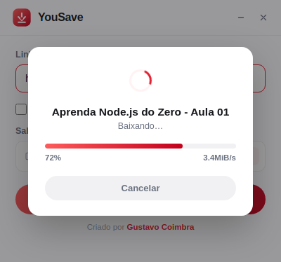

<p align="center">
  
</p>

<h1 align="center">YouSave</h1>

<p align="center">
  Baixe vídeos e músicas do YouTube em poucos cliques.<br>
  Sem anúncios, sem cadastro, sem limite de downloads. <b>100% grátis.</b>
</p>

<p align="center">
  <a href="https://github.com/gustavocoimbradev/yousave/releases/latest">⬇️ Baixar o YouSave</a>
</p>

---

## O que ele faz

Cole o link de um vídeo do YouTube, escolha se quer o vídeo completo ou só o áudio em MP3, clique em **Baixar** — e pronto. O arquivo fica salvo onde você quiser no seu computador.

- 🎬 Baixa vídeos completos, em boa qualidade
- 🎵 Ou só o áudio, direto em MP3
- 📁 Você escolhe a pasta de destino, e o app lembra dela da próxima vez
- ♾️ Sem limite de downloads
- 🚫 Sem anúncios, sem marca d'água, sem pegadinha
- 💸 Gratuito, sempre
- 🔄 Se atualiza sozinho — você nunca precisa reinstalar manualmente

## Como usar

1. Copie o link do vídeo no YouTube
2. Cole no YouSave
3. Marque a opção "somente áudio (MP3)" se for o caso
4. Clique em **Baixar**

Simples assim.

## Baixar o app

A versão mais recente para Windows está sempre disponível aqui:

**[github.com/gustavocoimbradev/yousave/releases/latest](https://github.com/gustavocoimbradev/yousave/releases/latest)**

---

<details>
<summary>Para desenvolvedores</summary>

```
npm install
npm start
```

Para gerar o instalador:

```
npm run build
```

</details>

---

<p align="center">Criado por <a href="https://github.com/gustavocoimbradev/">Gustavo Coimbra</a></p>
